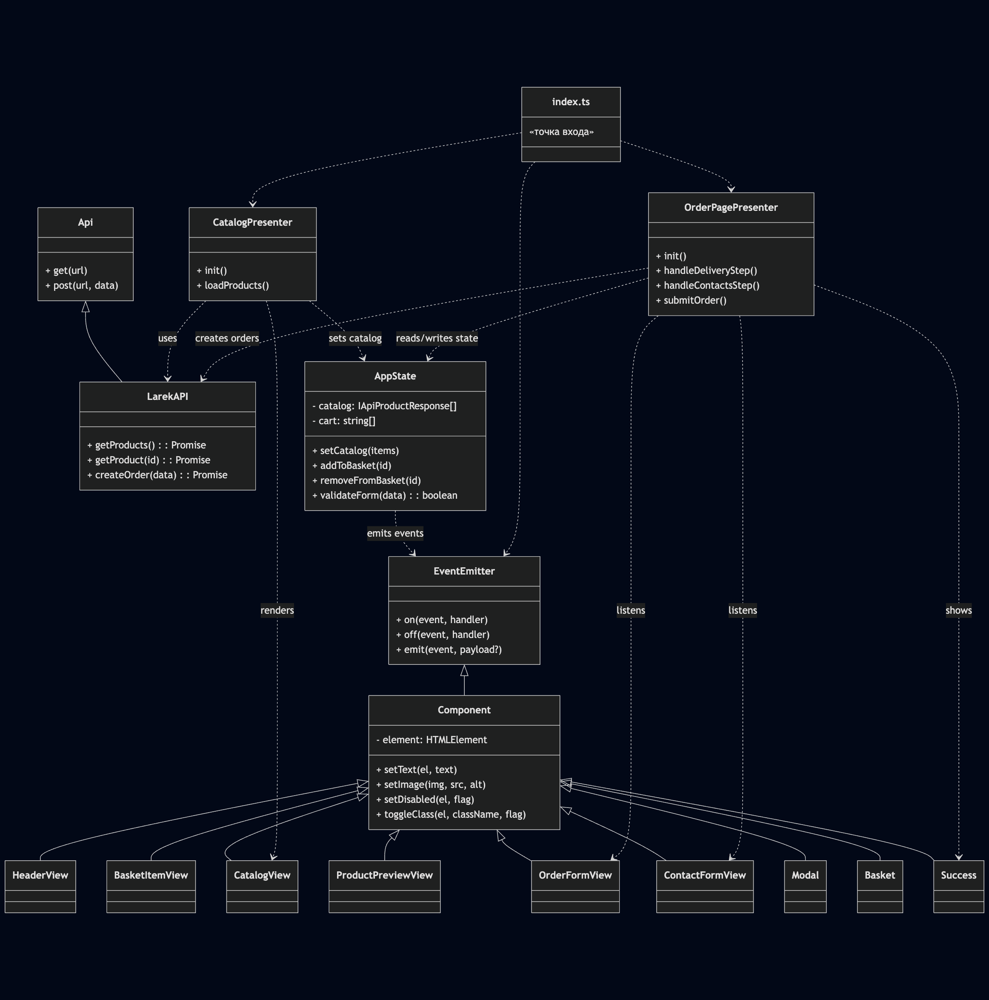

# Web-Ларёк

Интерактивный одностраничный интернет-магазин для веб-разработчиков: каталог товаров, корзина, оформление заказа в два шага.

---

## 📦 Стек

- **TypeScript**
- **HTML** + шаблоны `<template>`
- **SCSS** (бЭМ-блоки в `common.blocks/` + глобальные стили)
- **Webpack**
- **Архитектурный паттерн**: MVP (Model–View–Presenter)

---

## 🔧 Установка и запуск

```bash
# Установить зависимости
npm install

# Запустить в режиме разработки (с хот-релоадом)
npm run start

# Собрать финальный бандл
npm run build
```

```
src/
├── components/
│   ├── base/              # базовые классы: Component, EventEmitter
│   ├── common/            # переиспользуемые View-компоненты: Modal, Basket, Success
│   ├── presenter/         # презентеры: CatalogPresenter, OrderPagePresenter
│   ├── services/          # HTTP-клиент LarekAPI
│   └── views/             # View-компоненты: CatalogView, ProductPreviewView, OrderFormView, ContactFormView,
│                           #                  HeaderView, BasketItemView
├── scss/                  # стили
├── types/                 # TypeScript-типы и enum AppEvent
├── utils/                 # утилиты: ensureElement, ensureAllElements, cloneTemplate
├── index.ts               # точка входа, связывает Model, View, Presenter через EventEmitter
└── public/
    └── index.html         # шаблон страницы для Webpack

```

## Утилиты (src/utils/utils.ts)

- **ensureElement<T>(selector, context?) — безопасный поиск одного элемента, кидает ошибку, если не найден.**

- **ensureAllElements<T>(selector, context?) — поиск сразу нескольких элементов.**

- **cloneTemplate<T>(templateSelector) — клонирует <template> и возвращает первый элемент из .content.**

## Базовые классы (src/components/base)

### Component

**Назначение:** базовый класс для всех View-компонентов.

#### Методы:

- **setText(el, text) — безопасно установить textContent.**
- **setImage(img, src, alt) — установить src/alt для .**
- **setDisabled(el, flag) — включить/отключить кнопку или поле.**
- **toggleClass(el, className, flag) — добавить/убрать CSS-класс.**
- **protected element: HTMLElement — корневой элемент.**

### EventEmitter

- **Назначение:** реализация шины событий (pub/sub).

#### Функции:

- **on(event, handler) — подписаться.**
- **off(event, handler) — отписаться.**
- **emit(event, payload?) — уведомить всех слушателей.**

### Api / LarekAPI

- **Api (src/components/base/api.ts): низкоуровневый HTTP-клиент (get, post).**

- **LarekAPI (src/components/services/LarekAPI.ts): конкретные методы:**

- **getProducts(): Promise<IApiProductResponse[]> — получает список и сразу дополняет image полным URL.**

- **getProduct(id): Promise<IApiProductResponse> — тот же продукт по ID.**

- **createOrder(data): Promise<IApiOrderResponse> — отправка заказа.**

## Компоненты и презентеры

### Слой View (src/components/views)

- #### HeaderView
- **Кэширует .header**basket и .header**basket-counter.**

- **onBasketClick(handler) — подписка на открытие корзины.**

- **setCounter(count) — обновить счётчик.**
- #### BasketItemView
- **В конструкторе клонирует строку корзины и кэширует .basket**item-index, .card**title, .card**price, .basket**item-delete.**

- **Наполняет номер, название, цену; по клику эмитит ORDER_REMOVE_PRODUCT.**

- #### CatalogView

- **Рендерит сетку карточек товаров из массива IApiProductResponse.**

- **По клику эмитит PRODUCT_PREVIEW_OPEN.**

- #### ProductPreviewView

- **Рендерит модальное окно с детальной информацией о товаре.**

- **Кнопка «В корзину» / «Удалить», обновление по ORDER_ADD_PRODUCT / ORDER_REMOVE_PRODUCT.**

- #### OrderFormView

- **Шаг 1: выбор способа оплаты и ввод адреса.**

- **Эмитит ORDER_UPDATED при изменении полей.**

- **Слушает ORDER_FORM_VALIDITY_CHANGED и включает кнопку «Далее».**

- **По submit → ORDER_CONTACTS_REQUIRED.**

- #### ContactFormView

- **Шаг 2: ввод email и телефона.**

- **Аналогичная схема с ORDER_UPDATED и ORDER_FORM_VALIDITY_CHANGED.**

- **По submit → ORDER_SUBMIT.**

### Переиспользуемые компоненты (src/components/common)

- #### Modal

- **Обёртка для любого содержимого.**

- **Закрытие: клик вне контента или по крестику.**

- #### Basket

- **Показывает список `<li>` с товарами (шаблон #card-basket).**

- **Отображает суммарную стоимость.**

- **Управляет кнопкой «Оформить» (активна при ≥1 товаре).**

- #### Success

- **Сообщение об успешном оформлении заказа.**

### Presenter (src/components/presenter)

- #### CatalogPresenter

- **Запрашивает getProducts() у LarekAPI.**

- **Делает state.setCatalog(items) → CatalogView.render(items).**

- #### OrderPagePresenter

- **Слушает шаги процесса (ORDER_DELIVERY_REQUIRED, ORDER_CONTACTS_REQUIRED, ORDER_SUBMIT, ORDER_SUCCESS).**

- **Взаимодействует с state и modal / successView.**

## Типы данных (src/types)

### IApiProductResponse

```
interface IApiProductResponse {
  id: string;
  title: string;
  description: string;
  image: string;         // полный URL после LarekAPI
  category: string;
  price: number | null;  // null → «Бесценно»
}
```

### ICreateOrderRequest

```
interface ICreateOrderRequest {
  payment: 'online' | 'cash';
  address: string;
  email: string;
  phone: string;
  total: number;
  items: string[];       // массив id из корзины
}
```

### IApiOrderResponse

ts
Копировать
Редактировать

```
interface IApiOrderResponse {
  id: string;
  total: number;
}
```

### AppEvent (enum)

#### Перечисление всех событий приложения:

- **`CATALOG_CHANGED, CART_CHANGED, ORDER_UPDATED, ORDER_FORM_VALIDITY_CHANGED, ORDER_ADD_PRODUCT, ORDER_REMOVE_PRODUCT, ORDER_DELIVERY_REQUIRED, ORDER_CONTACTS_REQUIRED, ORDER_SUBMIT, ORDER_SUCCESS, PRODUCT_PREVIEW_OPEN и другие`.**

## Взаимодействие слоёв

### 1.Загрузка

- **`CatalogPresenter` → `LarekAPI.getProducts()` → `state.setCatalog` → `CatalogView.render`**

### 2.Предпросмотр

- **`CatalogView по клику` → `PRODUCT_PREVIEW_OPEN` → `в index.ts` → `ProductPreviewView.render(product, inCart)`**

### 3.Добавление в корзину

- **`ProductPreviewView` → `ORDER_ADD_PRODUCT/ORDER_REMOVE_PRODUCT` → `state.addToBaske/removeFromBasket` → `CART_CHANGED` → `Basket` обновляет список и total, `HeaderView` обновляет счётчик.**

### 4.Оформление заказа

- Шаг 1: **`OrderFormView → ORDER_UPDATED` → `AppState.validate` → `ORDER_FORM_VALIDITY_CHANGED` → активация кнопки → `ORDER_CONTACTS_REQUIRED`.**

- Шаг 2: **`ContactFormView` → аналогично → `ORDER_SUBMIT` → `LarekAPI.createOrder` → `ORDER_SUCCESS` → `Success` + сброс корзины.**

## Паттерны и практики

- **`MVP`: чёткое разделение Model (AppState), View и Presenter.**

- **`EventEmitter`: шина для слабосвязанного взаимодействия.**

- **`Утилиты`: ensureElement / ensureAllElements для безопасного поиска DOM.**

- **`Типизация`: строгий TS без any, интерфейсы в src/types.**

- **`Кэширование DOM`: все селекторы в конструкторе → поля класса.**

- **`Единая точка входа`: `src/index.ts`.**

## **Uml схема**


