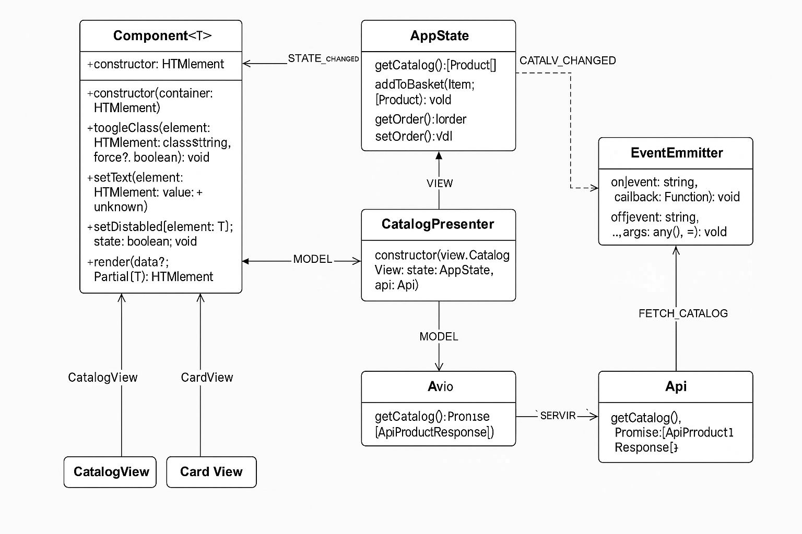

# Веб-приложение "Ларёк" — Архитектура

##  Технологический стек

- Язык: TypeScript
- Архитектура: MVP (Model-View-Presenter)
- Событийная система: EventEmitter
- HTTP-клиент: WebLarekAPI (на основе базового Api)
- Сборка: Webpack
- Типизация: интерфейсы, enum, дженерики
- Разделение: base, components, types

---

##  Инструкция по запуску

```bash
# 1. Установите зависимости
npm install

# 3. Запустите приложение
npm run start
```

---

## Архитектура

Проект реализован по паттерну **MVP (Model-View-Presenter)**. Все взаимодействия между слоями происходят через `EventEmitter`, что обеспечивает слабое связывание компонентов и лёгкую масштабируемость.

###  Основные слои:
- **Model** — хранение состояния приложения (`AppState`)
- **View** — отображение интерфейса (`Component<T>`, `ProductCardView`, `OrderFormView`, `PageView`)
- **Presenter** — посредник, реагирует на события и обновляет модель и представление

---

##  Структура проекта

```
src/
├── components/
│   ├── base/             # Универсальные классы
│   ├── common/           # Компоненты общего назначения (Modal, Form и т.п.)
│   ├── pages/            # Презентеры (CatalogPresenter, OrderPagePresenter)
│   ├── views/            # Классы отображения
│   └── AppState.ts       # Централизованное хранилище состояния
│
├── types/
│   ├── api/              # Типы API (запросы, ответы)
│   ├── events/           # События и их данные
│   └── app/              # Типы данных приложения (Product, Order и т.п.)
│
└── index.ts              # Инициализация приложения
```

---

##  Базовые классы

### `EventEmitter`
Позволяет подписываться на события, отписываться и эмитить события.

```ts
on(event: string, callback: (...args: any[]) => void): void
off(event: string, callback: (...args: any[]) => void): void
emit(event: string, ...args: any[]): void
```

---

### `Component<T>`
Абстрактный базовый класс для всех View-компонентов.

```ts
constructor(protected element: HTMLElement)
render(data?: T): void
getElement(): HTMLElement
destroy(): void
```

---

### `AppState`
Централизованная модель состояния приложения.

```ts
setCatalog(data: IProduct[]): void
addToBasket(id: string): void
updateOrder(data: Partial<IOrder>): void
getState(): AppStateData
```

---

##  События

Определены в `AppEvent`:

```ts
enum AppEvent {
  CATALOG_CHANGED = 'catalog:changed',
  CART_CHANGED = 'cart:changed',
  ORDER_UPDATED = 'order:updated',
  ORDER_SUBMIT = 'order:submit',
  ORDER_SUCCESS = 'order:success',
}
```

---

##  Взаимодействие компонентов

### Загрузка каталога:

- `CatalogPresenter` вызывает `LarekAPI.getProducts()`
- `AppState` сохраняет каталог и эмитит `CATALOG_CHANGED`
- View обновляет отображение каталога

### Работа с корзиной:

- Пользователь нажимает кнопку → `CART_ADD`
- `AppState` обновляет корзину → `CART_CHANGED`
- View обновляет корзину

### Заказ:

- View → событие `ORDER_SUBMIT`
- `OrderPagePresenter` → валидация, вызов `api.createOrder()`
- При успехе → `ORDER_SUCCESS`, отображается подтверждение

---

## 📘 Типы данных

```ts
// src/types/api/responses.ts
interface IApiProductResponse {
  id: string;
  title: string;
  price: number | null;
  image: string;
  description: string;
  category: string;
}

interface IApiOrderResponse {
  id: string;
  total: number;
}

// src/types/api/requests.ts
interface ICreateOrderRequest {
  payment: 'online' | 'cash';
  email: string;
  phone: string;
  address: string;
  total: number;
  items: string[];
}
```

---

##  Дополнительно

- Типизация строгая, `any` не используется
- Все компоненты изолированы и связаны через `EventEmitter`
- Презентеры — точка управления страницей (каталог, заказ)
- Модели и вью не зависят напрямую

---

##  UML-схема 



---


