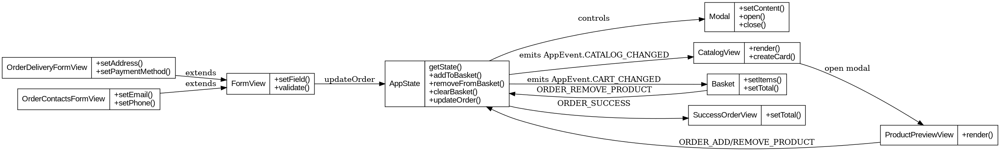

# Проектная работа "Web-Ларёк"

### 📦 Стек: TypeScript, HTML, SCSS, Webpack, MVP

## 🔧 Установка и запуск проекта

```bash
# Установка зависимостей
npm install

# Запуск проекта в режиме разработки
npm run start

# Сборка проекта
npm run build
```
## **Структура проекта**
```
src/ — исходные файлы проекта

components/ — компоненты приложения

base/ — базовые классы: Component, EventEmitter

views/ — компоненты отображения (View)

common/ — переиспользуемые компоненты, формы, корзина и пр.

types/ — типы данных, интерфейсы, перечисления

utils/ — утилиты и константы

index.ts — точка входа приложения

scss/ — стили

public/index.html — основной HTML

README.md — описание проекта
```
## **Архитектура проекта**
**Проект реализован по архитектурному паттерну MVP (Model–View–Presenter).**

### **Model:**
**- AppState — централизованное состояние приложения, хранит каталог, корзину, заказ**

**- LarekAPI — взаимодействие с сервером (API)**

**- Типы: IApiProductResponse, ICreateOrderRequest, IOrderResult**

### **View :**
#### **Компоненты, которые отвечают за отрисовку и DOM-логику:**

**- CatalogView — отображение каталога товаров**

**- ProductPreviewView — модальное окно с описанием товара**

**- Basket — корзина с товарами**

**- FormView, OrderContactsFormView, OrderDeliveryFormView — формы**

**- Modal — универсальное модальное окно**

**- SuccessOrderView — окно успешного оформления**

**- PageView — управление основными блоками страницы**

### **Presenter (Управляющий слой)**
**- EventEmitter — брокер событий, обеспечивает слабую связанность между модулями**

**- index.ts — связывает все слои**
### **Компоненты и назначение**
| Компонент               | Назначение                                  |
|-------------------------|---------------------------------------------|
| `AppState`              | Управление состоянием и логикой приложения |
| `Modal`                 | Модальное окно                              |
| `CatalogView`           | Рендер карточек товаров                     |
| `ProductPreviewView`    | Модальное окно карточки товара              |
| `Basket`                | Рендер списка товаров в корзине             |
| `OrderDeliveryFormView` | Форма доставки                              |
| `OrderContactsFormView` | Форма контактов                             |
| `FormView`              | Управление общей логикой форм               |
| `SuccessOrderView`      | Сообщение об успешной оплате                |

### **Типы данных**

```
export interface IApiProductResponse {
  id: string;
  title: string;
  description: string;
  image: string;
  category: string;
  price: number | null;
}

export interface ICreateOrderRequest {
  payment: 'online' | 'cash';
  address: string;
  email: string;
  phone: string;
  total: number;
  items: string[];
}

export interface IOrderResult {
  id: string;
  total: number;
}

```

### **Описание взаимодействий**
#### **1.При загрузке:**

- **Загружается каталог через LarekAPI**

- **Данные передаются в AppState**

- **Через событие CATALOG_CHANGED обновляется CatalogView**

#### **2.При клике на карточку:**

- **Срабатывает событие PRODUCT_PREVIEW_OPEN**

- **ProductPreviewView открывается с деталями товара**

#### **3.При добавлении товара:**

- **Событие ORDER_ADD_PRODUCT обновляет AppState**

- **CART_CHANGED вызывает обновление корзины и счётчика**

#### **4.При оформлении заказа:**

- **Форма разбита на 2 шага (доставка и контакты)**

- **После валидации отправляется запрос POST через LarekAPI**

- **Открывается окно успешного оформления**

### **Используемые паттерны**
- **MVP — Model-View-Presenter**

- **ventEmitter (брокер событий) — для слабой связанности**

- **Композиция вместо наследования в представлении**

- **Единая точка входа (index.ts) — для инициализации всех связей**
## **Uml схема**

